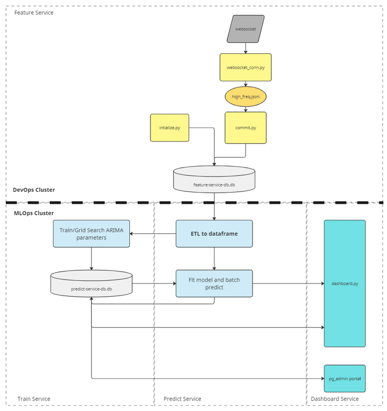
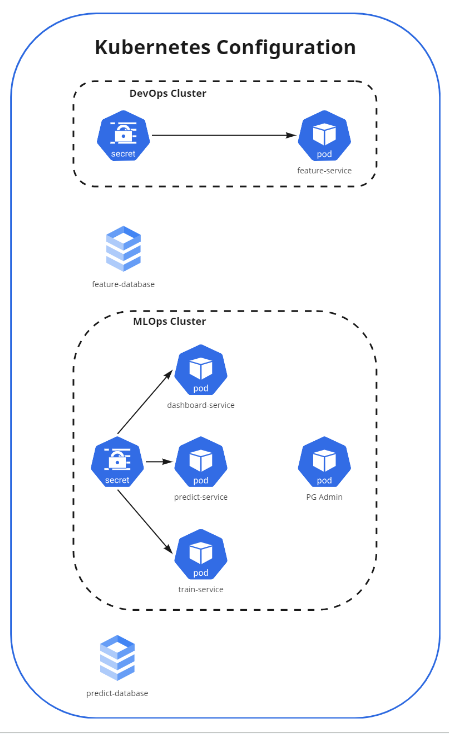

# Project Overview

## Description: Live asset prediction application. This is a MLOps application that streams live Bitcoin price, commits price history to a database and then serves MLOps prediction and training component. Finally, ML modeling metrics and components are committed to a model directory database and queried by a dashboard service.

## System Design


## Kubernetes Network


## Directory Tree
- A seperate deployment.yaml and reference README.md file are located within each service folder.

```
├───DevOps
│   └───feature-service
├───MLOps
│   ├───dashboard-service
│   │   └───PGAdmin
│   ├───predict-service
│   └───train-service
└───reference
```